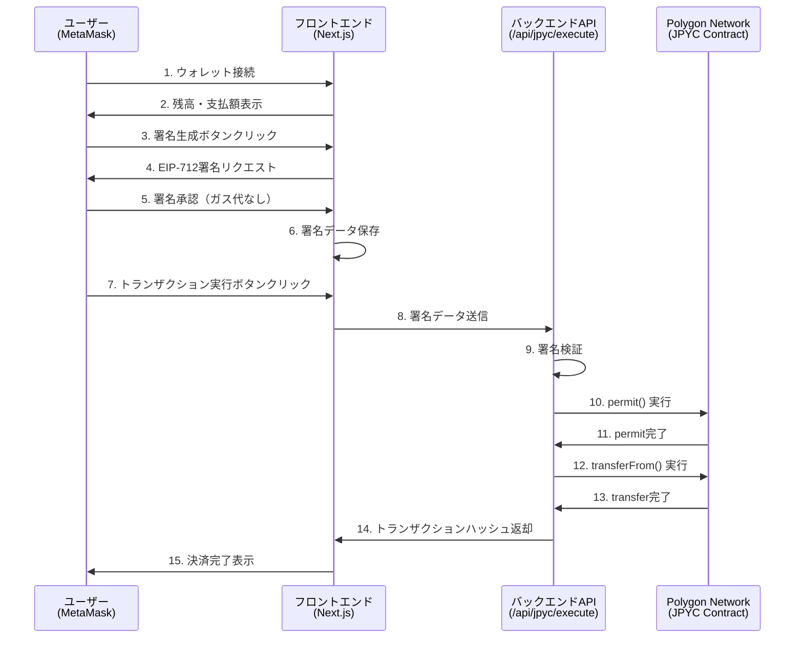

# JPYC決済システム 実装レポート

## 📋 概要

このレポートは、クラウドファンディングプロジェクトに実装されたJPYC（日本円ステーブルコイン）決済システムの仕様と導入手順を詳細にまとめたものです。

### JPYC決済の特徴

- **ガスレス決済**: ユーザーはガス代（トランザクション手数料）を支払う必要がありません
- **EIP-2612 Permit**: オフチェーン署名を使用した承認メカニズム
- **Polygon Network**: 高速・低コストなLayer 2ソリューション
- **手数料割引**: システム利用料5%がJPYC決済時に全額割引

---

## 🏗️ システムアーキテクチャ

### 全体フロー



### 2ステップ決済プロセス

#### ステップ1: EIP-712署名生成（フロントエンド）
- ユーザーがMetaMaskで署名を生成
- **ガス代不要**（オフチェーン署名）
- 署名データ（v, r, s）とnonceを取得

#### ステップ2: トランザクション実行（バックエンド）
- バックエンドウォレットがガス代を負担
- `permit()` → `transferFrom()` の2段階実行
- 所要時間: 約5〜7秒

---

## 🔧 技術スタック

### フロントエンド

| 技術 | バージョン | 用途 |
|------|-----------|------|
| **Next.js** | 15.5.7 | Reactフレームワーク |
| **React** | 19.2.0 | UIライブラリ |
| **wagmi** | 2.19.5 | Ethereum React Hooks |
| **viem** | 2.41.2 | Ethereum TypeScript ライブラリ |
| **ethers.js** | 6.15.0 | Ethereum JavaScript ライブラリ |
| **@reown/appkit** | 1.8.14 | ウォレット接続UI（旧RainbowKit） |
| **@tanstack/react-query** | 5.90.11 | データフェッチング・キャッシング |

### バックエンド

| 技術 | 用途 |
|------|------|
| **Next.js API Routes** | サーバーサイドAPI |
| **ethers.js v6** | Ethereum操作 |
| **Google Sheets API** | 注文データ保存 |

### ブロックチェーン

| 項目 | 詳細 |
|------|------|
| **ネットワーク** | Polygon (Chain ID: 137) |
| **トークン** | JPYC (ERC20 + EIP-2612) |
| **コントラクトアドレス** | `0xE7C3D8C9a439feDe00D2600032D5dB0Be71C3c29` |

---

## 📁 ファイル構成

### コアファイル

#### 1. フロントエンド - ウォレット接続

**[providers.tsx](file:///c:/Users/sbky0/Documents/claude%20desktop/crowdfunding-project/src/app/providers.tsx)**
```typescript
// Wagmi + Reown AppKit によるウォレット接続設定
- WagmiProvider: Ethereum接続管理
- QueryClientProvider: React Query設定
- createAppKit: マルチウォレット対応UI
```

**[WalletConnectButton.tsx](file:///c:/Users/sbky0/Documents/claude%20desktop/crowdfunding-project/src/components/WalletConnectButton.tsx)**
```typescript
// Reown AppKitのウォレット接続ボタン
- <appkit-button />: カスタムエレメント
```

#### 2. フロントエンド - 決済UI

**[JPYCPayment.tsx](file:///c:/Users/sbky0/Documents/claude%20desktop/crowdfunding-project/src/components/payment/JPYCPayment.tsx)** (357行)
```typescript
主要機能:
- ウォレット接続状態管理 (wagmi hooks)
- JPYC残高表示
- EIP-712署名生成 (handleGenerateSignature)
- トランザクション実行 (handleExecuteTransaction)
- エラーハンドリング
```

**[page.tsx](file:///c:/Users/sbky0/Documents/claude%20desktop/crowdfunding-project/src/app/backing/checkout/jpyc/page.tsx)** (272行)
```typescript
決済ページ:
- JPYCPaymentコンポーネント統合
- 注文内容表示
- 決済成功時の処理 (Google Sheets保存)
- 確認ページへのリダイレクト
```

#### 3. フロントエンド - サービスレイヤー

**[jpycService.ts](file:///c:/Users/sbky0/Documents/claude%20desktop/crowdfunding-project/src/lib/jpyc/jpycService.ts)** (184行)
```typescript
提供機能:
- getBalance(): JPYC残高取得
- generatePermitSignature(): EIP-712署名生成
- simpleTransfer(): 直接送金
- approveAndTransfer(): 承認+送金
- allowance(): 承認額確認
```

**[abi.ts](file:///c:/Users/sbky0/Documents/claude%20desktop/crowdfunding-project/src/lib/jpyc/abi.ts)** (129行)
```typescript
JPYC ERC20 ABI定義:
- balanceOf, transfer, approve, transferFrom
- permit (EIP-2612)
- nonces, DOMAIN_SEPARATOR
```

**[ethers-adapters.ts](file:///c:/Users/sbky0/Documents/claude%20desktop/crowdfunding-project/src/lib/ethers-adapters.ts)** (29行)
```typescript
Viem ↔ Ethers.js 変換:
- clientToSigner(): WalletClient → JsonRpcSigner
- clientToProvider(): Client → BrowserProvider
```

#### 4. バックエンド - API

**[route.ts](file:///c:/Users/sbky0/Documents/claude%20desktop/crowdfunding-project/src/app/api/jpyc/execute/route.ts)** (402行)
```typescript
POST /api/jpyc/execute
処理フロー:
1. リクエストバリデーション
2. EIP-712署名検証
3. Nonce確認
4. permit() 実行
5. transferFrom() 実行
6. トランザクションハッシュ返却
```

#### 5. 状態管理

**[BackingContext.tsx](file:///c:/Users/sbky0/Documents/claude%20desktop/crowdfunding-project/src/context/BackingContext.tsx)** (225行)
```typescript
グローバル状態:
- selectedRewards: 選択リターン
- backer: 支援者情報
- paymentMethod: 決済方法
- jpycPaymentState: JPYC決済状態
- calculateCheckoutSummary(): 手数料計算
```

---

## 🔐 EIP-712署名の仕組み

### Domain定義

```typescript
const domain = {
  name: 'JPY Coin',
  version: '1',
  chainId: 137,  // Polygon
  verifyingContract: '0xE7C3D8C9a439feDe00D2600032D5dB0Be71C3c29'
}
```

### Types定義

```typescript
const types = {
  Permit: [
    { name: 'owner', type: 'address' },
    { name: 'spender', type: 'address' },
    { name: 'value', type: 'uint256' },
    { name: 'nonce', type: 'uint256' },
    { name: 'deadline', type: 'uint256' }
  ]
}
```

### Value（署名データ）

```typescript
const value = {
  owner: '0xユーザーアドレス',
  spender: '0xバックエンドウォレットアドレス',
  value: '1000000000000000000',  // 1 JPYC (18 decimals)
  nonce: '0',  // コントラクトから取得
  deadline: 1733456789  // 現在時刻 + 3600秒
}
```

### 署名生成（フロントエンド）

```typescript
const signature = await signer.signTypedData(domain, types, value)
// 結果: "0x..." (130文字)

// 分解
const v = parseInt(signature.slice(128, 130), 16)
const r = '0x' + signature.slice(2, 66)
const s = '0x' + signature.slice(66, 130)
```

### 署名検証（バックエンド）

```typescript
const digest = ethers.TypedDataEncoder.hash(domain, types, value)
const recoveredAddress = ethers.recoverAddress(digest, { v, r, s })

if (recoveredAddress.toLowerCase() !== owner.toLowerCase()) {
  throw new Error('Signature does not match owner')
}
```

---

## 💰 手数料計算ロジック

### システム利用料

```typescript
const SYSTEM_FEE_RATE = 0.05  // 5%

// 例: リターン合計 10,000円の場合
const subtotal = 10000
const systemFee = Math.floor(10000 * 0.05) = 500
```

### JPYC決済時の割引

```typescript
// JPYC決済の場合、システム利用料が全額割引
const jpycDiscount = paymentMethod === 'jpyc' ? systemFee : 0

// 最終支払額
const total = subtotal + systemFee - jpycDiscount
// = 10,000 + 500 - 500 = 10,000円
```

### 決済方法別の比較

| 決済方法 | リターン合計 | システム利用料 | JPYC割引 | **最終支払額** |
|---------|------------|--------------|---------|--------------|
| 銀行振込 | 10,000円 | +500円 | 0円 | **10,500円** |
| PayPal | 10,000円 | +500円 | 0円 | **10,500円** |
| **JPYC** | 10,000円 | +500円 | **-500円** | **10,000円** |

---

## 🔑 環境変数

### フロントエンド（`.env.local`）

```bash
# Polygon RPC URL
NEXT_PUBLIC_POLYGON_RPC_URL=https://polygon-rpc.com

# JPYCトークンアドレス（Polygon Mainnet）
NEXT_PUBLIC_JPYC_TOKEN_ADDRESS=0xE7C3D8C9a439feDe00D2600032D5dB0Be71C3c29

# バックエンドウォレットアドレス（公開可）
NEXT_PUBLIC_BACKEND_WALLET_ADDRESS=0xE36A43fA750745E8A27522b927e84EE1B50e31D5

# WalletConnect Project ID
NEXT_PUBLIC_WALLETCONNECT_PROJECT_ID=your_project_id_here
```

### バックエンド（`.env.local`）

```bash
# バックエンドウォレット秘密鍵（絶対に公開しない）
BACKEND_WALLET_PRIVATE_KEY=0x...
```

> [!CAUTION]
> `BACKEND_WALLET_PRIVATE_KEY` は絶対にGitにコミットしないこと。`.gitignore` に `.env.local` が含まれていることを確認してください。

---

## 🚀 導入手順（逆算的再構築）

### Phase 1: 依存関係のインストール

```bash
npm install ethers@^6.15.0
npm install wagmi@^2.19.5
npm install viem@^2.41.2
npm install @reown/appkit@^1.8.14
npm install @reown/appkit-adapter-wagmi@^1.8.14
npm install @tanstack/react-query@^5.90.11
```

### Phase 2: ウォレット接続の設定

#### 2-1. Reown AppKit設定

[providers.tsx](file:///c:/Users/sbky0/Documents/claude%20desktop/crowdfunding-project/src/app/providers.tsx) を作成:

```typescript
'use client'

import { QueryClient, QueryClientProvider } from '@tanstack/react-query'
import { WagmiProvider } from 'wagmi'
import { createAppKit } from '@reown/appkit/react'
import { WagmiAdapter } from '@reown/appkit-adapter-wagmi'
import { polygon } from '@reown/appkit/networks'

const queryClient = new QueryClient()
const projectId = process.env.NEXT_PUBLIC_WALLETCONNECT_PROJECT_ID!

const wagmiAdapter = new WagmiAdapter({
  projectId,
  networks: [polygon],
})

createAppKit({
  projectId,
  adapters: [wagmiAdapter],
  networks: [polygon],
  features: {
    analytics: false,
  },
})

export function Providers({ children }: { children: React.ReactNode }) {
  return (
    <WagmiProvider config={wagmiAdapter.wagmiConfig}>
      <QueryClientProvider client={queryClient}>
        {children}
      </QueryClientProvider>
    </WagmiProvider>
  )
}
```

#### 2-2. ルートレイアウトに適用

`src/app/layout.tsx` を編集:

```typescript
import { Providers } from './providers'

export default function RootLayout({ children }) {
  return (
    <html>
      <body>
        <Providers>{children}</Providers>
      </body>
    </html>
  )
}
```

#### 2-3. ウォレット接続ボタン作成

[WalletConnectButton.tsx](file:///c:/Users/sbky0/Documents/claude%20desktop/crowdfunding-project/src/components/WalletConnectButton.tsx):

```typescript
'use client'

export default function WalletConnectButton() {
  return <appkit-button />
}
```

### Phase 3: Ethers.js アダプター作成

[ethers-adapters.ts](file:///c:/Users/sbky0/Documents/claude%20desktop/crowdfunding-project/src/lib/ethers-adapters.ts) を作成:

```typescript
import { BrowserProvider, JsonRpcSigner } from 'ethers'
import { type Account, type Chain, type Client, type Transport } from 'viem'

export function clientToSigner(client: Client<Transport, Chain, Account>) {
  const { account, chain, transport } = client
  const network = {
    chainId: chain.id,
    name: chain.name,
    ensAddress: chain.contracts?.ensRegistry?.address,
  }
  const provider = new BrowserProvider(transport, network)
  const signer = new JsonRpcSigner(provider, account.address)
  return signer
}
```

### Phase 4: JPYC ABI定義

[abi.ts](file:///c:/Users/sbky0/Documents/claude%20desktop/crowdfunding-project/src/lib/jpyc/abi.ts) を作成:

```typescript
export const JPYC_ABI = [
  // balanceOf
  {
    constant: true,
    inputs: [{ name: '_owner', type: 'address' }],
    name: 'balanceOf',
    outputs: [{ name: 'balance', type: 'uint256' }],
    type: 'function',
  },
  // permit (EIP-2612)
  {
    constant: false,
    inputs: [
      { name: 'owner', type: 'address' },
      { name: 'spender', type: 'address' },
      { name: 'value', type: 'uint256' },
      { name: 'deadline', type: 'uint256' },
      { name: 'v', type: 'uint8' },
      { name: 'r', type: 'bytes32' },
      { name: 's', type: 'bytes32' },
    ],
    name: 'permit',
    outputs: [],
    type: 'function',
  },
  // transferFrom
  {
    constant: false,
    inputs: [
      { name: '_from', type: 'address' },
      { name: '_to', type: 'address' },
      { name: '_value', type: 'uint256' },
    ],
    name: 'transferFrom',
    outputs: [{ name: '', type: 'bool' }],
    type: 'function',
  },
  // nonces
  {
    constant: true,
    inputs: [{ name: 'owner', type: 'address' }],
    name: 'nonces',
    outputs: [{ name: '', type: 'uint256' }],
    type: 'function',
  },
  // ... その他のABI
]
```

### Phase 5: JPYCサービス作成

[jpycService.ts](file:///c:/Users/sbky0/Documents/claude%20desktop/crowdfunding-project/src/lib/jpyc/jpycService.ts) を作成:

```typescript
import { Contract, BrowserProvider, TypedDataEncoder } from 'ethers'
import { JPYC_ABI } from './abi'

const JPYC_TOKEN_ADDRESS = process.env.NEXT_PUBLIC_JPYC_TOKEN_ADDRESS!

export const jpycService = {
  async getBalance(account: string, provider: BrowserProvider): Promise<string> {
    const contract = new Contract(JPYC_TOKEN_ADDRESS, JPYC_ABI, provider)
    const balance = await contract.balanceOf(account)
    return balance.toString()
  },

  async generatePermitSignature(
    owner: string,
    spender: string,
    amount: string,
    deadline: number,
    signer: any
  ) {
    const provider = signer.provider
    const contract = new Contract(JPYC_TOKEN_ADDRESS, JPYC_ABI, provider)
    
    // Nonce取得
    const nonce = await contract.nonces(owner)
    
    // Chain ID取得
    const network = await provider.getNetwork()
    const chainId = Number(network.chainId)
    
    // EIP-712 Domain
    const domain = {
      name: 'JPY Coin',
      version: '1',
      chainId,
      verifyingContract: JPYC_TOKEN_ADDRESS,
    }
    
    // Types
    const types = {
      Permit: [
        { name: 'owner', type: 'address' },
        { name: 'spender', type: 'address' },
        { name: 'value', type: 'uint256' },
        { name: 'nonce', type: 'uint256' },
        { name: 'deadline', type: 'uint256' },
      ],
    }
    
    // Value
    const value = {
      owner,
      spender,
      value: amount,
      nonce: nonce.toString(),
      deadline,
    }
    
    // 署名
    const signature = await signer.signTypedData(domain, types, value)
    
    // v, r, s に分解
    const sig = signature.slice(2)
    const r = '0x' + sig.slice(0, 64)
    const s = '0x' + sig.slice(64, 128)
    const v = parseInt(sig.slice(128, 130), 16)
    
    return { v, r, s, nonce: nonce.toString(), signature }
  }
}
```

### Phase 6: バックエンドAPI作成

[route.ts](file:///c:/Users/sbky0/Documents/claude%20desktop/crowdfunding-project/src/app/api/jpyc/execute/route.ts) を作成:

```typescript
import { NextResponse } from 'next/server'
import { ethers } from 'ethers'
import { JPYC_ABI } from '@/lib/jpyc/abi'

export async function POST(request: Request) {
  const body = await request.json()
  const { owner, spender, receiver, amount, deadline, nonce, signature } = body
  
  // 環境変数取得
  const BACKEND_PRIVATE_KEY = process.env.BACKEND_WALLET_PRIVATE_KEY!
  const JPYC_TOKEN_ADDRESS = process.env.NEXT_PUBLIC_JPYC_TOKEN_ADDRESS!
  const POLYGON_RPC_URL = process.env.NEXT_PUBLIC_POLYGON_RPC_URL!
  
  // Provider & Signer
  const provider = new ethers.JsonRpcProvider(POLYGON_RPC_URL)
  const wallet = new ethers.Wallet(BACKEND_PRIVATE_KEY, provider)
  const contract = new ethers.Contract(JPYC_TOKEN_ADDRESS, JPYC_ABI, wallet)
  
  // EIP-712署名検証
  const network = await provider.getNetwork()
  const domain = {
    name: 'JPY Coin',
    version: '1',
    chainId: Number(network.chainId),
    verifyingContract: JPYC_TOKEN_ADDRESS,
  }
  
  const types = {
    Permit: [
      { name: 'owner', type: 'address' },
      { name: 'spender', type: 'address' },
      { name: 'value', type: 'uint256' },
      { name: 'nonce', type: 'uint256' },
      { name: 'deadline', type: 'uint256' },
    ],
  }
  
  const value = { owner, spender, value: amount, nonce, deadline }
  const digest = ethers.TypedDataEncoder.hash(domain, types, value)
  const recoveredAddress = ethers.recoverAddress(digest, signature)
  
  if (recoveredAddress.toLowerCase() !== owner.toLowerCase()) {
    return NextResponse.json({ error: '署名が無効です' }, { status: 400 })
  }
  
  // Permit実行
  const permitTx = await contract.permit(
    owner, spender, amount, deadline,
    signature.v, signature.r, signature.s
  )
  await permitTx.wait(1)
  
  // TransferFrom実行
  const transferTx = await contract.transferFrom(owner, receiver, amount)
  const transferReceipt = await transferTx.wait(1)
  
  return NextResponse.json({
    success: true,
    transferTxHash: transferReceipt.hash
  })
}
```

### Phase 7: 決済UIコンポーネント作成

[JPYCPayment.tsx](file:///c:/Users/sbky0/Documents/claude%20desktop/crowdfunding-project/src/components/payment/JPYCPayment.tsx) を作成:

```typescript
'use client'

import { useState, useEffect } from 'react'
import { useAccount, useWalletClient } from 'wagmi'
import { jpycService } from '@/lib/jpyc/jpycService'
import { clientToSigner } from '@/lib/ethers-adapters'
import WalletConnectButton from '@/components/WalletConnectButton'

export const JPYCPayment = ({ onSuccess, onError }) => {
  const { address, isConnected } = useAccount()
  const { data: walletClient } = useWalletClient()
  const [signer, setSigner] = useState(null)
  const [signature, setSignature] = useState(null)
  const [deadline, setDeadline] = useState(null)
  
  // WalletClient → Signer変換
  useEffect(() => {
    if (walletClient) {
      const ethersSigner = clientToSigner(walletClient)
      setSigner(ethersSigner)
    }
  }, [walletClient])
  
  // ステップ1: 署名生成
  const handleGenerateSignature = async () => {
    const newDeadline = Math.floor(Date.now() / 1000) + 3600
    setDeadline(newDeadline)
    
    const sig = await jpycService.generatePermitSignature(
      address,
      backendWallet,
      amountInWei,
      newDeadline,
      signer
    )
    
    setSignature(sig)
  }
  
  // ステップ2: トランザクション実行
  const handleExecuteTransaction = async () => {
    const response = await fetch('/api/jpyc/execute', {
      method: 'POST',
      headers: { 'Content-Type': 'application/json' },
      body: JSON.stringify({
        owner: address,
        spender: backendWallet,
        receiver: backendWallet,
        amount: amountInWei,
        deadline,
        nonce: signature.nonce,
        signature: { v: signature.v, r: signature.r, s: signature.s }
      })
    })
    
    const data = await response.json()
    if (data.success) {
      onSuccess(data.transferTxHash)
    }
  }
  
  return (
    <div>
      {!isConnected ? (
        <WalletConnectButton />
      ) : (
        <>
          <button onClick={handleGenerateSignature}>署名を生成</button>
          <button onClick={handleExecuteTransaction} disabled={!signature}>
            トランザクションを実行
          </button>
        </>
      )}
    </div>
  )
}
```

### Phase 8: 決済ページ作成

[page.tsx](file:///c:/Users/sbky0/Documents/claude%20desktop/crowdfunding-project/src/app/backing/checkout/jpyc/page.tsx) を作成:

```typescript
'use client'

import { useRouter } from 'next/navigation'
import { JPYCPayment } from '@/components/payment/JPYCPayment'

export default function JPYCCheckoutPage() {
  const router = useRouter()
  
  const handlePaymentSuccess = async (transactionHash: string) => {
    // Google Sheetsに保存
    await fetch('/api/checkout', {
      method: 'POST',
      body: JSON.stringify({
        backer,
        backing: {
          total_amount: checkoutSummary.total,
          payment_method: 'jpyc',
          transaction_id: transactionHash
        },
        items
      })
    })
    
    // 確認ページへ
    router.push(`/backing/confirmation?tx_hash=${transactionHash}`)
  }
  
  return (
    <div>
      <h1>JPYC決済</h1>
      <JPYCPayment onSuccess={handlePaymentSuccess} />
    </div>
  )
}
```

### Phase 9: 環境変数設定

`.env.local` ファイルを作成:

```bash
# Polygon RPC
NEXT_PUBLIC_POLYGON_RPC_URL=https://polygon-rpc.com

# JPYC Contract
NEXT_PUBLIC_JPYC_TOKEN_ADDRESS=0xE7C3D8C9a439feDe00D2600032D5dB0Be71C3c29

# Backend Wallet
NEXT_PUBLIC_BACKEND_WALLET_ADDRESS=0xYourBackendWalletAddress
BACKEND_WALLET_PRIVATE_KEY=0xYourPrivateKey

# WalletConnect
NEXT_PUBLIC_WALLETCONNECT_PROJECT_ID=your_project_id
```

### Phase 10: バックエンドウォレットの準備

1. **新しいウォレット作成**
   ```bash
   # MetaMaskまたはethers.jsで新規ウォレット作成
   ```

2. **MATICを入金**
   - Polygonネットワークでガス代として使用
   - 目安: 0.1 MATIC以上

3. **秘密鍵を環境変数に設定**
   ```bash
   BACKEND_WALLET_PRIVATE_KEY=0x...
   ```

---

## 🧪 テスト手順

### 1. ローカル環境でのテスト

```bash
npm run dev
```

### 2. テストフロー

1. `/backing/checkout/jpyc` にアクセス
2. 「ウォレットを接続」ボタンをクリック
3. MetaMaskでPolygonネットワークに接続
4. JPYC残高を確認
5. 「署名を生成」ボタンをクリック
6. MetaMaskで署名を承認（ガス代なし）
7. 「トランザクションを実行」ボタンをクリック
8. 5〜7秒待機
9. 決済完了を確認
10. Polygonscanでトランザクションを確認

### 3. エラーケースのテスト

- ❌ JPYC残高不足
- ❌ Polygon以外のネットワーク接続
- ❌ 署名期限切れ
- ❌ Nonce不一致

---

## 🔍 トラブルシューティング

### よくある問題

#### 1. 「署名が無効です」エラー

**原因**: フロントエンドとバックエンドでDomain定義が一致していない

**解決策**:
- `name`, `version`, `chainId`, `verifyingContract` を確認
- 両方で同じ値を使用していることを確認

#### 2. 「Nonce が一致しません」エラー

**原因**: 署名生成後にコントラクトのNonceが変更された

**解決策**:
- 署名を再生成
- 署名生成からトランザクション実行まで連続して実行

#### 3. 「MATIC残高がありません」エラー

**原因**: バックエンドウォレットのMATIC残高不足

**解決策**:
- バックエンドウォレットにMATICを送金
- 目安: 0.1 MATIC以上

#### 4. ウォレット接続できない

**原因**: WalletConnect Project IDが未設定

**解決策**:
```bash
NEXT_PUBLIC_WALLETCONNECT_PROJECT_ID=your_project_id
```

---

## 📊 データフロー

### 署名データの流れ

```mermaid
graph LR
    A[ユーザー] -->|1. 署名リクエスト| B[MetaMask]
    B -->|2. EIP-712署名| C[JPYCPayment]
    C -->|3. 署名保存| D[State]
    D -->|4. 署名送信| E[/api/jpyc/execute]
    E -->|5. 署名検証| F[ethers.recoverAddress]
    F -->|6. permit実行| G[JPYC Contract]
    G -->|7. transferFrom実行| G
    G -->|8. TxHash| E
    E -->|9. 成功レスポンス| C
    C -->|10. 確認ページへ| H[/backing/confirmation]
```

### Google Sheetsへのデータ保存

```mermaid
graph TD
    A[決済完了] --> B[/api/checkout]
    B --> C{データ検証}
    C -->|OK| D[Google Sheets API]
    C -->|NG| E[エラーレスポンス]
    D --> F[Backingsシート]
    D --> G[Itemsシート]
    F --> H[backing_id生成]
    G --> H
    H --> I[確認ページへリダイレクト]
```

---

## 🎯 重要なポイント

### セキュリティ

> [!IMPORTANT]
> - バックエンドウォレットの秘密鍵は絶対に公開しない
> - `.env.local` を `.gitignore` に追加
> - EIP-712署名検証を必ず実行
> - Deadline（有効期限）を設定

### パフォーマンス

> [!TIP]
> - `wait(1)` で1ブロック確認のみ（約2秒）
> - 並列処理は避ける（permit → transferFrom は順次実行）
> - エラーハンドリングを充実させる

### ユーザー体験

> [!NOTE]
> - ガス代不要であることを明示
> - 所要時間（5〜7秒）を表示
> - 残高不足時は事前に警告
> - トランザクションハッシュをPolygonscanで確認可能に

---

## 📚 参考資料

### 公式ドキュメント

- [JPYC公式サイト](https://jpyc.jp/)
- [EIP-2612: Permit Extension for ERC-20](https://eips.ethereum.org/EIPS/eip-2612)
- [EIP-712: Typed structured data hashing and signing](https://eips.ethereum.org/EIPS/eip-712)
- [Wagmi Documentation](https://wagmi.sh/)
- [Ethers.js v6 Documentation](https://docs.ethers.org/v6/)
- [Reown AppKit](https://docs.reown.com/appkit/overview)

### コントラクト情報

- **JPYC Token (Polygon)**: `0xE7C3D8C9a439feDe00D2600032D5dB0Be71C3c29`
- [Polygonscan - JPYC](https://polygonscan.com/token/0xE7C3D8C9a439feDe00D2600032D5dB0Be71C3c29)

---

## 🎉 まとめ

このJPYC決済システムは、以下の特徴を持つ最先端の実装です:

✅ **ガスレス決済**: ユーザーはガス代を支払わない  
✅ **EIP-2612 Permit**: オフチェーン署名による承認  
✅ **セキュア**: EIP-712署名検証で安全性確保  
✅ **高速**: Polygon上で5〜7秒で完了  
✅ **手数料割引**: システム利用料5%が全額割引  
✅ **モダンスタック**: wagmi + viem + ethers.js v6

この実装を他のプロジェクトに適用する際は、環境変数の設定とバックエンドウォレットの準備を忘れずに行ってください。
