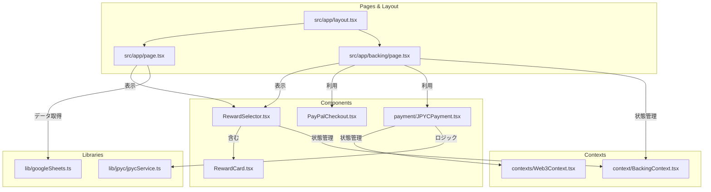

# プロジェクト構造分析レポート

このドキュメントは、クラウドファンディングプロジェクトのファイルとディレクトリ構造を詳細に解説します。

## 1. 📂 ディレクトリツリー図

```
C:/Users/sbky0/Documents/claude desktop/crowdfunding-project/
├───.next/                 # Next.jsビルド成果物
├───node_modules/          # プロジェクト依存関係
├───public/                # 静的アセット
│   ├───rewards/
│   ├───file.svg
│   ├───globe.svg
│   ├───next.svg
│   ├───vercel.svg
│   └───window.svg
├───src/                   # ソースコード
│   ├───app/               # Next.js App Router
│   │   ├───api/           # APIエンドポイント
│   │   │   ├───checkout/
│   │   │   ├───dashboard/
│   │   │   ├───jpyc/
│   │   │   └───rewards/
│   │   ├───backing/       # 支援フロー関連ページ
│   │   │   ├───checkout/
│   │   │   └───confirmation/
│   │   │   └───page.tsx
│   │   ├───favicon.ico
│   │   ├───globals.css
│   │   ├───layout.tsx     # ルートレイアウト
│   │   └───page.tsx       # トップページ
│   ├───components/        # 再利用可能なReactコンポーネント
│   │   ├───payment/
│   │   │   └───JPYCPayment.tsx
│   │   ├───Dashboard.tsx
│   │   ├───PayPalCheckout.tsx
│   │   ├───RewardCard.tsx
│   │   └───RewardSelector.tsx
│   ├───context/           # Reactコンテキスト (単数形)
│   │   └───BackingContext.tsx
│   ├───contexts/          # Reactコンテキスト (複数形)
│   │   └───Web3Context.tsx
│   ├───lib/               # ライブラリ、ユーティリティコード
│   │   ├───jpyc/
│   │   │   ├───abi.ts
│   │   │   └───jpycService.ts
│   │   ├───googleSheets.ts
│   │   └───mockData.ts
│   └───types/             # TypeScript型定義
│       └───backing.ts
├───.env.local             # ローカル環境変数
├───.gitignore             # Git無視ファイル設定
├───next.config.ts         # Next.js設定ファイル
├───package.json           # プロジェクト設定と依存関係
├───postcss.config.mjs     # PostCSS設定
├───README.md              # プロジェクト README
├───tsconfig.json          # TypeScript設定
└───... (その他プロジェクトファイル)
```

## 2. 🗺️ 各ディレクトリの説明

- **`src/`**: プロジェクトの主要なソースコードが格納されています。アプリケーションのロジック、UIコンポーネント、型定義などが含まれます。
- **`src/app/`**: Next.js 13以降のApp Routerに対応したディレクトリ構造です。各サブディレクトリがURLのルーティングパスに対応します。
- **`src/app/api/`**: サーバーサイドで実行されるAPIエンドポイントが定義されています。決済処理やデータ取得などのバックエンドロジックをここに配置します。
- **`src/app/backing/`**: プロジェクト支援（バッキング）に関連する一連のページ（支援選択、チェックアウト、確認）が含まれます。
- **`src/components/`**: アプリケーション全体で再利用されるReactコンポーネント（例: `RewardCard`, `Dashboard`）が格納されています。
- **`src/context/` & `src/contexts/`**: ReactのContext APIを用いて状態管理を行うためのファイルが置されています。`BackingContext`は支援フローの状態を、`Web3Context`はWeb3関連の状態を管理していると推測されます。（注: `context`と`contexts`の2つのディレクトリが存在しており、統一することが望ましいかもしれません。）
- **`src/lib/`**: 特定のフレームワークに依存しない、再利用可能な関数やユーティリティ、外部サービスとの連携コード（Google Sheets, JPYCなど）が格納されています。
- **`src/types/`**: プロジェクト全体で使用されるTypeScriptの型定義がまとめられています。
- **`public/`**: 画像、フォント、SVGなどの静的ファイルが配置されます。これらのファイルはアプリケーションのルートURLから直接アクセス可能です。
- **`.next/`**: `npm run dev`や`npm run build`を実行した際にNext.jsが自動生成するビルドファイルやキャッシュが格納されます。直接編集することはありません。
- **`node_modules/`**: `package.json`で定義されたすべての依存パッケージがインストールされるディレクトリです。

## 3. 📄 重要なファイル一覧

### ⚙️ 設定ファイル

- **`package.json`**: プロジェクト名、バージョン、依存パッケージ（`dependencies`）、開発用パッケージ（`devDependencies`）、実行スクリプト（`scripts`）などを定義するNPMの根幹ファイル。
- **`next.config.ts`**: Next.jsの動作をカスタマイズするための設定ファイル。画像の外部ドメイン許可やリダイレクト設定などが可能です。
- **`tsconfig.json`**: TypeScriptコンパイラの設定ファイル。コンパイル対象のファイルや出力オプション、厳格な型チェックの有効化などを指定します。
- **`.env.local`**: APIキーやデータベース接続情報など、環境に依存する秘密情報を格納するファイル。Gitリポジトリには含まれません。
- **`postcss.config.mjs`**: Tailwind CSSなどのPostCSSプラグインを設定するためのファイルです。
- **`.gitignore`**: Gitがバージョン管理から除外すべきファイルやディレクトリ（`node_modules`, `.next`, `.env.local`など）を指定します。

### アプリケーション主要ファイル

- **`src/app/layout.tsx`**: 全ページで共通のルートレイアウトを定義するコンポーネント。HTMLの`<html>`や`<body>`タグを含み、ヘッダー、フッター、共通のUI要素を配置します。
- **`src/app/page.tsx`**: アプリケーションのトップページ（`/`）に対応するコンポーnent。プロジェクトのメインコンテンツが表示されます。
- **`src/app/globals.css`**: アプリケーション全体に適用されるグローバルなCSSスタイルシート。Tailwind CSSのベーススタイルなどが定義されます。
- **`src/lib/googleSheets.ts`**: Google Sheets APIと連携し、スプレッドシートからデータを読み書きするためのロジックが実装されていると推測されます。
- **`src/lib/jpyc/jpycService.ts`**: JPYC（日本円ステーブルコイン）に関連する処理を行うサービス。コントラクトとのやり取りや決済ロジックが含まれる可能性があります。

## 4. 🔗 ファイル関連図 (Mermaid)

主要なコンポーネントとページの関連性を示します。



**図の解説:**
- `layout.tsx`は、`page.tsx`（トップページ）や`backing/page.tsx`（支援ページ）など、すべてのページの基礎となります。
- トップページや支援ページでは、リワード選択コンポーネント `RewardSelector.tsx` が使われます。
- `RewardSelector.tsx` は個々のリワードを表示する `RewardCard.tsx` を含みます。
- 支援ページ(`backing/page.tsx`)では、`PayPalCheckout.tsx` や `JPYCPayment.tsx` といった決済コンポーネントが利用されます。
- 支援フローの状態（選択されたリワードなど）は `BackingContext.tsx` で管理され、関連コンポーネントから利用されます。
- JPYCでの決済は `Web3Context.tsx` (ウォレット接続など) と `jpycService.ts` (コントラクト対話) に依存します。
- `googleSheets.ts` は、ページコンポーネントからデータソースとして利用される可能性があります。

## 5. 🚀 クイックナビゲーション

### よく編集するファイル (ロジック & UI)

- **トップページ**: `src/app/page.tsx`
- **支援ページ**: `src/app/backing/page.tsx`
- **共通レイアウト**: `src/app/layout.tsx`
- **リワードカード**: `src/components/RewardCard.tsx`
- **ダッシュボード**: `src/components/Dashboard.tsx`
- **グローバルCSS**: `src/app/globals.css`

### ⚙️ 設定ファイル

- **プロジェクト依存関係**: `package.json`
- **Next.js設定**: `next.config.ts`
- **TypeScript設定**: `tsconfig.json`
- **環境変数**: `.env.local`

### 🔌 API & 外部連携

- **Google Sheets連携**: `src/lib/googleSheets.ts`
- **JPYC決済サービス**: `src/lib/jpyc/jpycService.ts`
- **APIエンドポイント**: `src/app/api/` ディレクトリ以下
